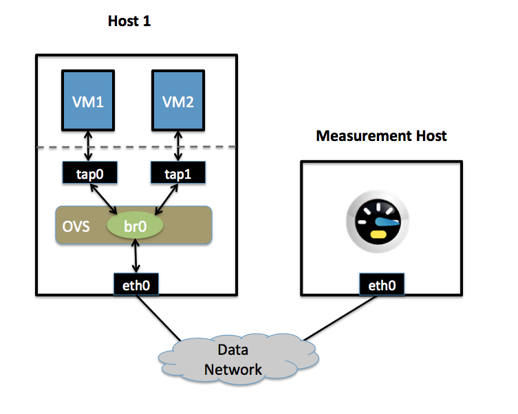

..
      Licensed under the Apache License, Version 2.0 (the "License"); you may
      not use this file except in compliance with the License. You may obtain
      a copy of the License at

          http://www.apache.org/licenses/LICENSE-2.0

      Unless required by applicable law or agreed to in writing, software
      distributed under the License is distributed on an "AS IS" BASIS, WITHOUT
      WARRANTIES OR CONDITIONS OF ANY KIND, either express or implied. See the
      License for the specific language governing permissions and limitations
      under the License.

      Convention for heading levels in Open vSwitch documentation:

      =======  Heading 0 (reserved for the title in a document)
      -------  Heading 1
      ~~~~~~~  Heading 2
      +++++++  Heading 3
      '''''''  Heading 4

      Avoid deeper levels because they do not render well.

======================================
Quality of Service (QoS) Rate Limiting
======================================

This document explains how to use Open vSwitch to rate-limit traffic by a VM to
either 1 Mbps or 10 Mbps.

Setup
-----

This guide assumes the environment is configured as described below.

One Physical Network
~~~~~~~~~~~~~~~~~~~~

- Data Network

  Ethernet network for VM data traffic. This network is used to send traffic to
  and from an external host used for measuring the rate at which a VM is
  sending. For experimentation, this physical network is optional; you can
  instead connect all VMs to a bridge that is not connected to a physical
  interface and use a VM as the measurement host.

There may be other networks (for example, a network for management traffic),
but this guide is only concerned with the Data Network.

Two Physical Hosts
~~~~~~~~~~~~~~~~~~

The first host, named `host1`, is a hypervisor that runs Open vSwitch and has
one NIC. This single NIC, `eth0`, is connected to the Data Network. Because it
is participating in an OVS bridge, no IP address can be assigned on `eth0`.

The second host, named Measurement Host, can be any host capable of measuring
throughput from a VM. For this guide, we use `netperf
<http://www.netperf.org>`__, a free tool for testing the rate at which one host
can send to another. The Measurement Host has only a single NIC, `eth0`, which
is connected to the Data Network. `eth0` has an IP address that can reach any
VM on `host1`.

Two VMs
~~~~~~~

Both VMs (`vm1` and `vm2`) run on `host1`.

Each VM has a single interface that appears as a Linux device (e.g., ``tap0``) on the physical host.

.. note::
  For Xen/XenServer, VM interfaces appears as Linux devices with names like
  ``vif1.0``. Other Linux systems may present these interfaces as ``vnet0``,
  ``vnet1``, etc.

Configuration Steps
-------------------

For both VMs, we modify the Interface table to configure an ingress policing rule. There are two values to set:

``ingress_policing_rate``
  the maximum rate (in Kbps) that this VM should be allowed to send

``ingress_policing_burst``
  a parameter to the policing algorithm to indicate the maximum amount of data
  (in Kb) that this interface can send beyond the policing rate.

To rate limit VM1 to 1 Mbps, use these commands::

    $ ovs-vsctl set interface tap0 ingress_policing_rate=1000
    $ ovs-vsctl set interface tap0 ingress_policing_burst=100

Similarly, to limit `vm2` to 10 Mbps, enter these commands on `host1`::

    $ ovs-vsctl set interface tap1 ingress_policing_rate=10000
    $ ovs-vsctl set interface tap1 ingress_policing_burst=1000

To see the current limits applied to VM1, run this command::

    $ ovs-vsctl list interface tap0

Testing
-------

To test the configuration, make sure `netperf` is installed and running on both
VMs and on the Measurement Host. `netperf` consists of a client (``netperf``)
and a server (``netserver``). In this example, we run ``netserver`` on the
Measurement Host (installing Netperf usually starts ``netserver`` as a daemon,
meaning this is running by default).

For this example, we assume that the Measurement Host has an IP of 10.0.0.100
and is reachable from both VMs.

From `vm1`, run this command::

    $ netperf -H 10.0.0.100

This will cause VM1 to send TCP traffic as quickly as it can to the Measurement
Host. After 10 seconds, this will output a series of values. We are interested
in the "Throughput" value, which is measured in Mbps (10^6 bits/sec). For VM1
this value should be near 1. Running the same command on VM2 should give a
result near 10.

Troubleshooting
---------------

Open vSwitch uses the Linux `traffic-control
<http://lartc.org/howto/lartc.qdisc.html>`__ capability for rate-limiting. If
you are not seeing the configured rate-limit have any effect, make sure that
your kernel is built with "ingress qdisc" enabled, and that the user-space
utilities (e.g., ``/sbin/tc``) are installed.

Additional Information
----------------------

Open vSwitch's rate-limiting uses policing, which does not queue packets. It
drops any packets beyond the specified rate. Specifying a larger burst size
lets the algorithm be more forgiving, which is important for protocols like TCP
that react severely to dropped packets. Setting a burst size of less than than
the MTU (e.g., 10 kb) should be avoided.

For TCP traffic, setting a burst size to be a sizeable fraction (e.g., > 10%)
of the overall policy rate helps a flow come closer to achieving the full rate.
If a burst size is set to be a large fraction of the overall rate, the client
will actually experience an average rate slightly higher than the specific
policing rate.

For UDP traffic, set the burst size to be slightly greater than the MTU and
make sure that your performance tool does not send packets that are larger than
your MTU (otherwise these packets will be fragmented, causing poor
performance). For example, you can force netperf to send UDP traffic as 1000
byte packets by running::

    $ netperf -H 10.0.0.100 -t UDP_STREAM -- -m 1000
