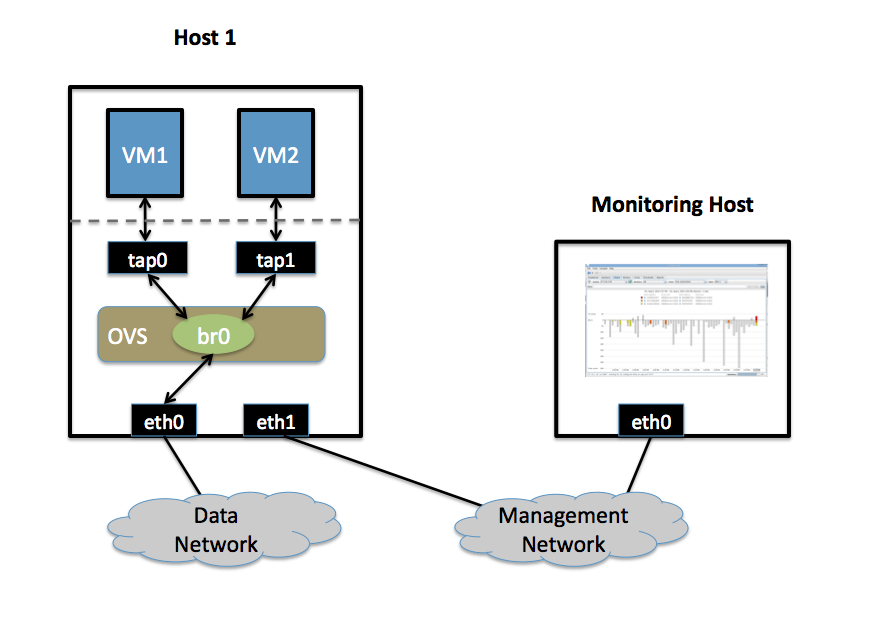

..
      Licensed under the Apache License, Version 2.0 (the "License"); you may
      not use this file except in compliance with the License. You may obtain
      a copy of the License at

          http://www.apache.org/licenses/LICENSE-2.0

      Unless required by applicable law or agreed to in writing, software
      distributed under the License is distributed on an "AS IS" BASIS, WITHOUT
      WARRANTIES OR CONDITIONS OF ANY KIND, either express or implied. See the
      License for the specific language governing permissions and limitations
      under the License.

      Convention for heading levels in Open vSwitch documentation:

      =======  Heading 0 (reserved for the title in a document)
      -------  Heading 1
      ~~~~~~~  Heading 2
      +++++++  Heading 3
      '''''''  Heading 4

      Avoid deeper levels because they do not render well.

================================
Monitoring VM Trafic Using sFlow
================================

This document describes how to use Open vSwitch is to monitor traffic sent
between two VMs on the same host using an sFlow collector.
VLANs.

Setup
-----

This guide assumes the environment is configured as described below.

Two Physical Networks
~~~~~~~~~~~~~~~~~~~~~

- Data Network

   Ethernet network for VM data traffic. For experimentation, this physical
   network is optional. You can instead connect all VMs to a bridge that is not
   connected to a physical interface.

- Management Network

  This network must exist, as it is used to send sFlow data from the agent to
  the remote collector.

Two Physical Hosts
~~~~~~~~~~~~~~~~~~

The environment assumes the use of two hosts: `host1` and `hostMon`. `host` is
a hypervisor that run Open vSwitch and has two NICs:

- eth0 is connected to the Data Network. No IP address can be assigned on eth0
  because it is part of an OVS bridge.

- eth1 is connected to the Management Network. eth1 has an IP address for
  management traffic, including sFlow.

`hostMon` can be any computer that can run the sFlow collector. For this
cookbook entry, we use `sFlowTrend
<http://www.inmon.com/products/sFlowTrend.php>`__, a free sFlow collector that
is a simple cross-platform Java download. Other sFlow collectors should work
equally well. `hostMon` has a single NIC, `eth0`, that is connected to the
Management Network. `eth0` has an IP adress that can reach `eth1` on `host1`.

Two Virtual Machines
~~~~~~~~~~~~~~~~~~~~

This guide uses two virtual machines - `vm1` and `vm2`-  running on `host1`.

.. note::
  For Xen/XenServer, VM interfaces appears as Linux devices with names like
  ``vif1.0``. Other Linux systems may present these interfaces as ``vnet0``,
  ``vnet1``, etc.

Configuration Steps
-------------------

On `host1`, define the following configuration values in your shell
environment::

    COLLECTOR_IP=10.0.0.1
    COLLECTOR_PORT=6343
    AGENT_IP=eth1
    HEADER_BYTES=128
    SAMPLING_N=64
    POLLING_SECS=10

Port 6343 (``COLLECTOR_PORT``) is the default port number for sFlowTrend. If
you are using an sFlow collector other than sFlowTrend, set this value to the
appropriate port for your particular collector. Set your own IP address for the
collector in the place of 10.0.0.1 (``COLLECTOR_IP``). Setting the ``AGENT_IP``
value to eth1 indicates that the sFlow agent should send traffic from `eth1`'s
IP address. The other values indicate settings regarding the frequency and type
of packet sampling that sFlow should perform.

Still on `host1`, run the following command to create an sFlow configuration
and attach it to bridge br0::

    $ ovs-vsctl -- --id=@sflow create sflow agent=${AGENT_IP} \
        target="${COLLECTOR_IP}:${COLLECTOR_PORT}" header=${HEADER_BYTES} \
        sampling=${SAMPLING_N} polling=${POLLING_SECS} \
          -- set bridge br0 sflow=@sflow

Make note of the UUID that is returned by this command; this value is necessary
to remove the sFlow configuration.

On `hostMon`, go to the `sFlowTrend
<http://www.inmon.com/products/sFlowTrend.php>`__ and click "Install" in the
upper right-hand corner. If you have Java installed, this will download and
start the sFlowTrend application. Once sFlowTrend is running, the light in the
lower right-hand corner of the sFlowTrend application should blink green to
indicate that the collector is receiving traffic.

The sFlow configuration is now complete, and sFlowTrend on `hostMon` should be
receiving sFlow data from OVS on `host1`.

To configure sFlow on additional bridges, just replace ``br0`` in the above
command with a different bridge name.

To remove sFlow configuration from a bridge (in this case, ``br0``), run this
command, where "sFlow UUID" is the UUID returned by the command used to set the
sFlow configuration initially::

    $ ovs-vsctl remove bridge br0 sflow <sFlow UUID>

To see all current sets of sFlow configuration parameters, run::

    $ ovs-vsctl list sflow

Troubleshooting
---------------

If sFlow data isn't being collected and displayed by sFlowTrend, check the
following items:

- Make sure the VMs are sending/receiving network traffic over bridge br0,
  preferably to multiple other hosts and using a variety of protocols.

- To confirm that the agent is sending traffic, check that running the
  following command shows that the agent on the physical server is sending
  traffic to the collector IP address (change the port below to match the port
  your collector is using)::

      $ tcpdump -ni eth1 udp port 6343

If no traffic is being sent, there is a problem with the configuration of OVS.
If traffic is being sent but nothing is visible in the sFlowTrend user
interface, this may indicate a configuration problem with the collector.

Check to make sure the host running the collector (`hostMon`) does not have a
firewall that would prevent UDP port 6343 from reaching the collector.

Credit
------

This document is heavily based on content from Neil McKee at InMon:

- `https://mail.openvswitch.org/pipermail/ovs-dev/2010-July/165245.html
  <https://mail.openvswitch.org/pipermail/ovs-dev/2010-July/165245.html>`__

- `http://blog.sflow.com/2010/01/open-vswitch.html
  <http://blog.sflow.com/2010/01/open-vswitch.html>`__ (note: the configuration
  syntax is out of date, but the high-level descriptions are correct)
